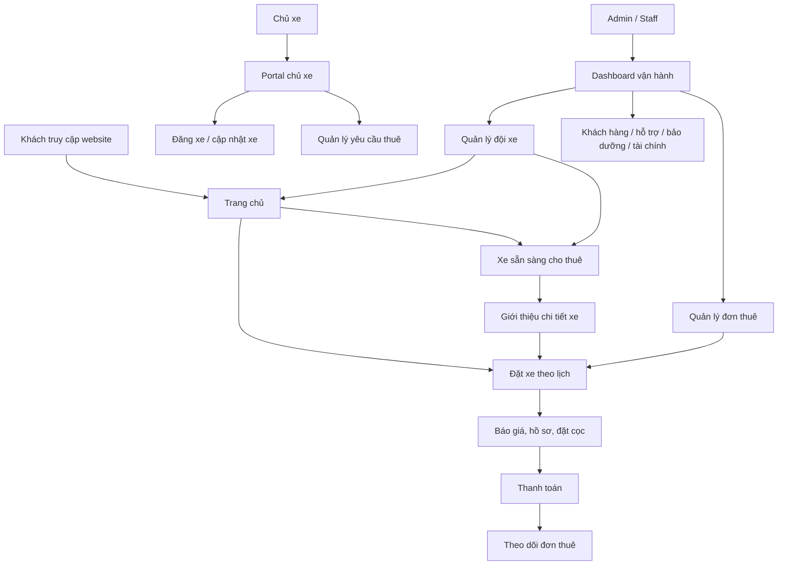
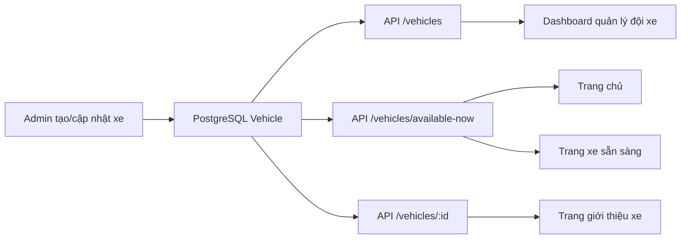

# Sơ đồ chức năng website datxe

Tài liệu này mô tả các chức năng hiện tại để kiểm tra mức độ hợp lý giữa website public, khu vực khách hàng, chủ xe và admin.

## 1. Sơ đồ tổng quan

## 2. Danh sách chức năng theo khu vực

| Khu vực | Route | Chức năng chính | Nguồn dữ liệu |
|---|---|---|---|
| Public | `/` | Trang chủ, tìm kiếm, xe nổi bật, quy trình thuê xe | API vehicles available-now |
| Public | `/vehicles` | Danh sách xe đang sẵn sàng cho thuê | API vehicles available-now |
| Public | `/vehicles/[id]` | Giới thiệu chi tiết xe, ảnh, giá, quy định, điểm nhận | API vehicles detail |
| Public | `/booking` | Kiểm tra lịch thuê, chọn xe, báo giá, upload hồ sơ | API vehicles search, bookings quote/create |
| Public | `/track` | Tra cứu đơn thuê | API bookings track |
| Public | `/payment` | Thanh toán/cọc | API payments/bookings |
| Owner | `/owner` | Dashboard chủ xe | API owner data |
| Owner | `/owner/add-car` | Chủ xe đăng xe mới | API vehicles create + storage |
| Owner | `/owner/vehicles/[id]/edit` | Chủ xe chỉnh xe của mình | API vehicles update |
| Admin | `/dashboard` | Tổng quan vận hành | API dashboard/analytics |
| Admin | `/dashboard/vehicles` | Quản lý đội xe, ảnh, trạng thái, chỉnh sửa, xóa | API vehicles |
| Admin | `/dashboard/vehicles/new` | Admin thêm xe mới | API vehicles create + storage |
| Admin | `/dashboard/vehicles/[id]` | Chi tiết xe trong dashboard | API vehicles detail |
| Admin | `/dashboard/vehicles/[id]/edit` | Admin chỉnh thông tin xe | API vehicles update |
| Admin | `/dashboard/bookings` | Quản lý đơn thuê và chuyển trạng thái | API bookings |
| Admin | `/dashboard/customers` | CRM khách hàng | API customers |
| Admin | `/dashboard/maintenance` | Lịch bảo dưỡng | API maintenance |
| Admin | `/dashboard/finance` | Doanh thu, chi phí | API analytics |
| Admin | `/dashboard/tickets` | Hỗ trợ khách hàng | API tickets |
| Admin | `/dashboard/audit` | Nhật ký thay đổi hệ thống | API audit logs |

## 3. Logic đồng bộ dữ liệu xe

## 4. Logic kiểm tra xe đang rảnh

Xe được xem là đang sẵn sàng cho thuê khi thỏa cả ba điều kiện:

- Trạng thái xe là `AVAILABLE`.
- Xe không có booking `PENDING`, `CONFIRMED` hoặc `RENTING` đang phủ thời điểm hiện tại.
- Xe có ít nhất một hình ảnh để khách kiểm tra thông tin cơ bản.

Với luồng đặt xe theo ngày giờ cụ thể, `/booking` vẫn gọi API search để kiểm tra trùng lịch theo khoảng thời gian khách chọn.

## 5. Điểm cần kiểm tra thêm

- [ ] Admin thêm xe mới và xe xuất hiện ở `/vehicles`.
- [ ] Admin đổi trạng thái sang `Bảo dưỡng` hoặc `Đã khóa` và xe biến mất khỏi trang public.
- [ ] Xe thiếu ảnh không xuất hiện ở trang xe sẵn sàng.
- [ ] Booking đang phủ thời điểm hiện tại làm xe không xuất hiện trong danh sách xe rảnh.
- [ ] Trang chi tiết xe hiển thị đúng ảnh, giá, điểm nhận, giới hạn km và quy định thuê.
